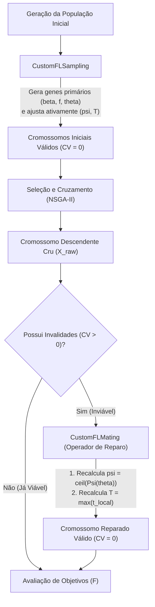

# Funcionamento dos Operadores CustomFLSampling e CustomFLMating no AFEA/FLOPT

Este documento exemplifica detalhadamente como os operadores customizados **`CustomFLSampling`** (inicialização guiada) e **`CustomFLMating`** (cruzamento com operador de reparo) garantem que os cromossomos mantidos pelo algoritmo evolucionário NSGA-II satisfaçam as restrições operacionais do sistema de Aprendizagem Federada.

---

## 1. Instância do Problema ($N = 3$ Dispositivos)

Para esta demonstração, extraímos os 3 primeiros dispositivos da configuração oficial [`config_afea_n11.json`](./configs/config_afea_n11.json):

### Parâmetros Globais
* **Taxa de Erro Limite ($\epsilon_0$)**: $0.999$
* **Histórico de Transmissão ($\theta_{\text{prev}}$)**: $[0.10, 0.10, 0.10]$

### Tabela de Parâmetros dos Dispositivos
| Dispositivo ($n$) | $\alpha_n$ (coef. energia) | $c_n$ (ciclos/bit) | $S_n$ (tamanho modelo em bits) | $f_{n, \text{min}}$ (GHz) | $f_{n, \text{max}}$ (GHz) |
| :---: | :---: | :---: | :---: | :---: | :---: |
| **0** | $5.128 \times 10^{-9}$ | $25.6363$ | $747,088,320$ | $1.4$ ($1.4 \times 10^9$ Hz) | $2.0$ ($2.0 \times 10^9$ Hz) |
| **1** | $5.060 \times 10^{-9}$ | $25.5332$ | $684,321,792$ | $1.5$ ($1.5 \times 10^9$ Hz) | $1.8$ ($1.8 \times 10^9$ Hz) |
| **2** | $4.912 \times 10^{-9}$ | $39.2031$ | $748,350,720$ | $2.6$ ($2.6 \times 10^9$ Hz) | $3.9$ ($3.9 \times 10^9$ Hz) |

---

## 2. Estrutura do Cromossomo no NSGA-II / pymoo

No pymoo, uma solução $X$ para um problema de variáveis mistas (`MixedVariableProblem`) é representada como um **dicionário de genes**:

$$
X = \left\{ T, \; \text{beta}_0, f_0, \theta_0, \psi_0, \; \text{beta}_1, f_1, \theta_1, \psi_1, \; \text{beta}_2, f_2, \theta_2, \psi_2 \right\}
$$

### Restrições que Devem ser Satisfeitas ($g_i(x) \le 0$)
1. **$g_1^{(n)}$ (Tempo limite)**: $\beta_n \cdot \left(\frac{\psi_n \cdot c_n \cdot S_n}{f_n}\right) - T \le 0 \implies \text{tempo local do dispositivo } n \le T$.
2. **$g_2^{(n)}$ (Rodadas locais para convergência)**:
   * Se $\beta_n = 1$: $\Psi(\theta_n) - \psi_n \le 0 \implies \psi_n \ge \Psi(\theta_n)$, onde $\Psi(\theta_n) = -\log_2(1 - \theta_n)$.
   * Se $\beta_n = 0$: $\psi_n - \Psi(\theta_n) \le 0 \implies \psi_n \le \Psi(\theta_n)$.
3. **$g_3^{(n)}$ (Degradabilidade mínima)**: $\theta_{\text{prev}, n} \cdot 0.99 - \theta_n \le 0 \implies \theta_n \ge 0.099$.
4. **$g_4$ (Ativação mínima)**: $1 - \sum_{n=0}^{N-1} \beta_n \le 0 \implies \sum \beta_n \ge 1$.

---

## 3. Demonstração do `CustomFLSampling` (Criação de Duas Soluções Válidas)

O operador [`CustomFLSampling`](./FLPOPT/operators.py#L4-L46) substitui a amostragem puramente aleatória por um processo de **inicialização guiada**:
1. Gera aleatoriamente os genes de decisão primários: $\beta_n$, $f_n$ e $\theta_n$.
2. Calcula a demanda teórica $\Psi(\theta_n) = -\log_2(1 - \theta_n)$.
3. Ajusta o gene $\psi_n$ com uma perturbação apropriada ao valor de $\beta_n$.
4. Determina o menor tempo limite necessário $T_{\text{min}} = \max_n \left( \frac{\beta_n \cdot c_n \cdot S_n \cdot \psi_n}{f_n} \right)$ e adiciona uma margem positiva para formar o gene $T$.

---

### Solução Válida A (Pai 1)

#### 1. Valores Sorteados
* $\beta^{(A)} = [1, 1, 0]$ *(Dev 0 e Dev 1 selecionados; Dev 2 desativado)*
* $f^{(A)} = [1.8 \times 10^9, 1.5 \times 10^9, 3.0 \times 10^9]$ Hz
* $\theta^{(A)} = [0.25, 0.30, 0.60]$

#### 2. Guiamento dos Genes $\psi$ e $T$ pelo `CustomFLSampling`
* $\Psi(\theta_0) = -\log_2(1 - 0.25) \approx 0.4150 \implies \psi_0 = 2$ ($\ge 0.4150 \checkmark$)
* $\Psi(\theta_1) = -\log_2(1 - 0.30) \approx 0.5146 \implies \psi_1 = 3$ ($\ge 0.5146 \checkmark$)
* $\Psi(\theta_2) = -\log_2(1 - 0.60) \approx 1.3219 \implies \psi_2 = 1$ ($\le 1.3219 \checkmark$)

Cálculo dos Tempos de Computação Local:
* $t_0 = \frac{1 \cdot 25.6363 \cdot 747,088,320 \cdot 2}{1.8 \times 10^9} = 21.2806 \text{ s}$
* $t_1 = \frac{1 \cdot 25.5332 \cdot 684,321,792 \cdot 3}{1.5 \times 10^9} = 34.9458 \text{ s}$
* $t_2 = 0 \text{ s}$ (desativado)
* $T_{\text{min}}^{(A)} = \max(21.2806, 34.9458, 0) = 34.9458 \text{ s}$

O sampling atribui $T^{(A)} = 40.00 \text{ s}$ (margem de $+5.0542 \text{ s}$).

#### Representação em Cromossomo $X_A$:
```python
X_A = {
    "T": 40.00,
    "beta_0": 1, "f_0": 1.8e9, "theta_0": 0.25, "psi_0": 2,
    "beta_1": 1, "f_1": 1.5e9, "theta_1": 0.30, "psi_1": 3,
    "beta_2": 0, "f_2": 3.0e9, "theta_2": 0.60, "psi_2": 1
}
```
**Violação de Restrições ($CV$)**: $CV(X_A) = 0.00$ *(Totalmente Válida)*.

---

### Solução Válida B (Pai 2)

#### 1. Valores Sorteados
* $\beta^{(B)} = [0, 1, 1]$ *(Dev 0 desativado; Dev 1 e Dev 2 selecionados)*
* $f^{(B)} = [1.4 \times 10^9, 1.8 \times 10^9, 3.6 \times 10^9]$ Hz
* $\theta^{(B)} = [0.70, 0.20, 0.40]$

#### 2. Guiamento dos Genes $\psi$ e $T$ pelo `CustomFLSampling`
* $\Psi(\theta_0) = -\log_2(1 - 0.70) \approx 1.7370 \implies \psi_0 = 1$ ($\le 1.7370 \checkmark$)
* $\Psi(\theta_1) = -\log_2(1 - 0.20) \approx 0.3219 \implies \psi_1 = 2$ ($\ge 0.3219 \checkmark$)
* $\Psi(\theta_2) = -\log_2(1 - 0.40) \approx 0.7370 \implies \psi_2 = 2$ ($\ge 0.7370 \checkmark$)

Cálculo dos Tempos de Computação Local:
* $t_0 = 0 \text{ s}$ (desativado)
* $t_1 = \frac{1 \cdot 25.5332 \cdot 684,321,792 \cdot 2}{1.8 \times 10^9} = 19.4144 \text{ s}$
* $t_2 = \frac{1 \cdot 39.2031 \cdot 748,350,720 \cdot 2}{3.6 \times 10^9} = 16.2987 \text{ s}$
* $T_{\text{min}}^{(B)} = \max(0, 19.4144, 16.2987) = 19.4144 \text{ s}$

O sampling atribui $T^{(B)} = 25.00 \text{ s}$ (margem de $+5.5856 \text{ s}$).

#### Representação em Cromossomo $X_B$:
```python
X_B = {
    "T": 25.00,
    "beta_0": 0, "f_0": 1.4e9, "theta_0": 0.70, "psi_0": 1,
    "beta_1": 1, "f_1": 1.8e9, "theta_1": 0.20, "psi_1": 2,
    "beta_2": 1, "f_2": 3.6e9, "theta_2": 0.40, "psi_2": 2
}
```
**Violação de Restrições ($CV$)**: $CV(X_B) = 0.00$ *(Totalmente Válida)*.

---

## 4. Cruzamento e Operador de Reparo (`CustomFLMating`)

No processo de evolução, o operador padrão de cruzamento de variáveis mistas (`MixedVariableMating`) combina aleatoriamente os genes dos pais $X_A$ e $X_B$.

### Etapa 1: Descendente Gerado pelo Cruzamento Genérico ($X_{\text{cru}}$)

Suponha a seguinte recombinação de genes:
* Gene $\beta$ herda de $X_A \implies \beta = [1, 1, 0]$
* Gene $f$ herda de $X_B \implies f = [1.4 \times 10^9, 1.8 \times 10^9, 3.6 \times 10^9]$
* Gene $\theta$ herda de $X_B \implies \theta = [0.70, 0.20, 0.40]$
* Gene $\psi$ herda de $X_A \implies \psi = [1, 3, 1]$
* Gene $T$ herda de $X_B \implies T = 25.00 \text{ s}$

```python
X_off_cru = {
    "T": 25.00,
    "beta_0": 1, "f_0": 1.4e9, "theta_0": 0.70, "psi_0": 1,  # Invalidez 1!
    "beta_1": 1, "f_1": 1.8e9, "theta_1": 0.20, "psi_1": 3,  # Invalidez 2!
    "beta_2": 0, "f_2": 3.6e9, "theta_2": 0.40, "psi_2": 1
}
```

#### Análise das Invalidades do Cromossomo Cru:
1. **Violação em Dev 0 (Restrição $g_2^{(0)}$)**:
   * Com $\theta_0 = 0.70$, o número mínimo de rodadas locais exigido é $\Psi(0.70) = -\log_2(0.30) = 1.7370$.
   * Como $\beta_0 = 1$, é obrigatório que $\psi_0 \ge 1.7370$.
   * O cromossomo herdou $\psi_0 = 1$. Como $1 < 1.7370$, temos $g_2^{(0)} = 1.7370 - 1 = +0.7370 > 0$ **(VIOLAÇÃO!)**.
2. **Violação de Tempo Limite (Restrição $g_1^{(1)}$)**:
   * Para Dev 1, com $\psi_1 = 3$ e $f_1 = 1.8 \times 10^9$:
     $$t_1 = \frac{1 \cdot 25.5332 \cdot 684,321,792 \cdot 3}{1.8 \times 10^9} = 29.1215 \text{ s}$$
   * No entanto, o cromossomo herda $T = 25.00 \text{ s}$.
   * Como $29.1215 > 25.00$, temos $g_1^{(1)} = 29.1215 - 25.00 = +4.1215 > 0$ **(VIOLAÇÃO!)**.

*Conclusão da Etapa 1*: Sem intervenção, o descendente é **inviável** ($CV(X_{\text{cru}}) = 0.7370 + 4.1215 = 4.8585$).

---

### Etapa 2: Aplicação do Operador de Reparo ([`CustomFLMating`](file:///c:/Users/Nilo/Desktop/UFES/Mestrado%20Inf/Dissertacao/AFEA/FLPOPT/operators.py#L48-L85))

O operador [`CustomFLMating`](file:///c:/Users/Nilo/Desktop/UFES/Mestrado%20Inf/Dissertacao/AFEA/FLPOPT/operators.py#L48-L85) intercepta o descendente e aplica as correções:

#### 1. Reparo dos Genes $\psi_n$
* **Dev 0 ($\beta_0 = 1$)**: Recalcula $\psi_0 = \lceil \Psi(0.70) \rceil = \lceil 1.7370 \rceil = 2$.
* **Dev 1 ($\beta_1 = 1$)**: Recalcula $\psi_1 = \lceil \Psi(0.20) \rceil = \lceil 0.3219 \rceil = 1$.
* **Dev 2 ($\beta_2 = 0$)**: Recalcula $\psi_2 = \max(1, \lfloor \Psi(0.40) \rfloor) = \max(1, \lfloor 0.7370 \rfloor) = 1$.

Vetor corrigido: $\psi = [2, 1, 1]$.

#### 2. Reparo do Gene $T$
Recalcula o tempo de processamento necessário com os novos valores de $\psi$:
* $t_0 = \frac{1 \cdot 25.6363 \cdot 747,088,320 \cdot 2}{1.4 \times 10^9} = 27.3608 \text{ s}$
* $t_1 = \frac{1 \cdot 25.5332 \cdot 684,321,792 \cdot 1}{1.8 \times 10^9} = 9.7072 \text{ s}$
* $t_2 = 0 \text{ s}$

Define o gene $T$ exatamente no gargalo:
$$T = \max(27.3608, 9.7072, 0) = 27.3608 \text{ s}$$

---

### Etapa 3: Descendente Final Reparado ($X_{\text{reparado}}$)

```python
X_off_reparado = {
    "T": 27.3608,
    "beta_0": 1, "f_0": 1.4e9, "theta_0": 0.70, "psi_0": 2,  # Reparado!
    "beta_1": 1, "f_1": 1.8e9, "theta_1": 0.20, "psi_1": 1,  # Reparado!
    "beta_2": 0, "f_2": 3.6e9, "theta_2": 0.40, "psi_2": 1
}
```

#### Reavaliação de Restrições no Descendente Reparado:
* $g_1^{(0)} = 27.3608 - 27.3608 = 0.00 \le 0 \checkmark$
* $g_1^{(1)} = 9.7072 - 27.3608 = -17.6536 \le 0 \checkmark$
* $g_2^{(0)} = 1.7370 - 2 = -0.2630 \le 0 \checkmark$
* $g_2^{(1)} = 0.3219 - 1 = -0.6781 \le 0 \checkmark$
* $g_4 = 1 - (1+1+0) = -1 \le 0 \checkmark$

**Violação Total de Restrições**: $CV(X_{\text{reparado}}) = 0.00$ *(Totalmente Válida e Viável)*.

---

## 5. Resumo do Fluxo Operacional


